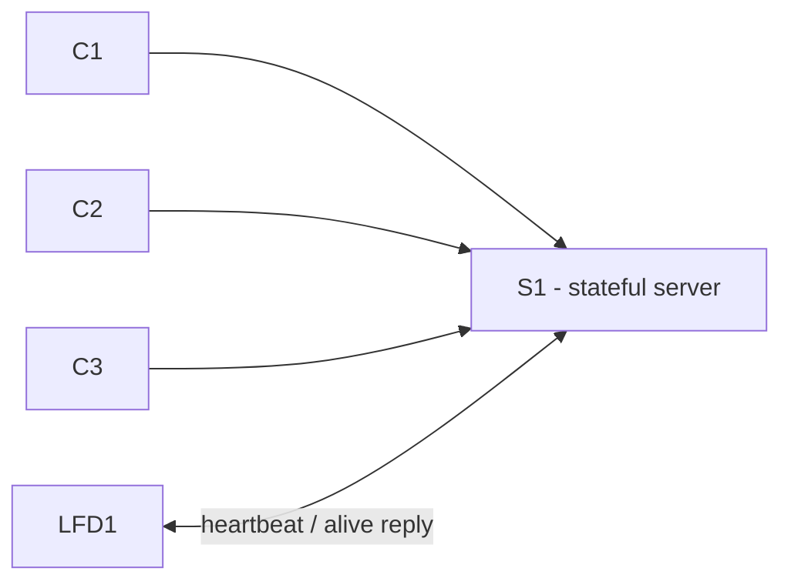
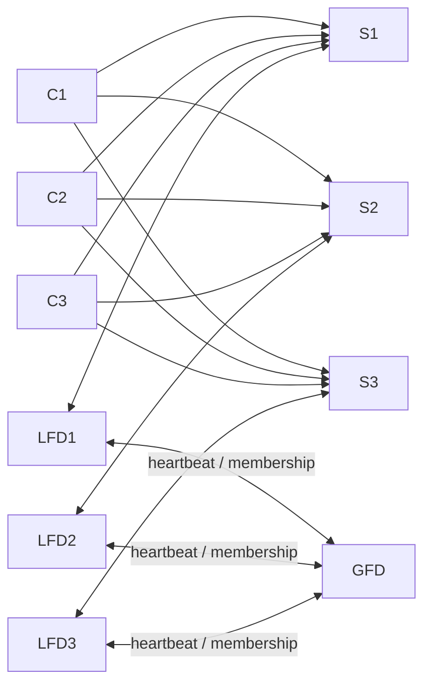

# 18-749 Reliable Distributed Systems - Python

## Introduction

This project implements a simplified fault-tolerant distributed application in **Python**. The full course project gradually adds replication, fault detection, membership management, checkpointing, and recovery so that the application can continue running when a server replica fails.

For Milestone 1, we build only one stateful server, three independent clients, and one Local Fault Detector (LFD). The simplest valid application is a shared counter:

```text
my_state = 0
C1 sends ADD 1
S1 updates my_state to 1
S1 replies with STATE 1
```

The project is demonstrated through terminal output. No website, database, Docker configuration, or cloud deployment is required for Milestone 1.

## Status

**Milestones 1 and 2 are implemented and verified** (single-laptop demos for both; Milestone 1 additionally verified two-laptop). See [AGENT_CONTEXT.md](AGENT_CONTEXT.md) for implementation details, design decisions, and bugs found/fixed during testing.

## Milestone 1

### Goals

1. Run a client-server application.
2. Demonstrate that LFD1 detects when S1 crashes.
3. Support a configurable heartbeat frequency at LFD1.

### Architecture



| Location | Processes |
| --- | --- |
| Sacred/client machine | C1, C2, C3 |
| Non-sacred/server machine | S1 and LFD1 |

`C1`, `C2`, and `C3` can use the same Python file, but they run as separate processes with different client IDs. LFD1 runs on the same machine as S1.

### Required behavior

- [x] S1 listens for TCP connections.
- [x] C1, C2, and C3 each send requests to S1.
- [x] S1 changes `my_state` when it receives a client request.
- [x] Each client prints sent requests and received replies.
- [x] S1 prints received requests, sent replies, and `my_state` before processing and before replying.
- [x] LFD1 sends a heartbeat to S1 repeatedly.
- [x] LFD1 maintains and prints `heartbeat_count`.
- [x] `heartbeat_freq` is configurable through a command-line argument and is not hard-coded.
- [x] S1 prints heartbeat receipt and its alive reply.
- [x] After S1 is killed with `Ctrl-C`, LFD1 prints a failed-heartbeat/timeout message.
- [x] Restart the system using a different heartbeat frequency and repeat the demonstration.

Clients support both modes: `--mode auto` (default, sends on a timer in a loop) and `--mode manual` (prompts for each request from the keyboard).

### Message and logging conventions

Every console message should start with a local timestamp. Each client request needs a unique request number and client ID; each reply returns those same identifiers.

```text
<C1, S1, 1, request>
<C1, S1, 1, reply>
```

Suggested line-based message protocol:

```text
REQUEST|C1|S1|1|ADD|1
REPLY|C1|S1|1|STATE|1
HEARTBEAT|LFD1|S1|1
ALIVE|S1|LFD1|1
```

The exact message format is a team choice; the course guide does not mandate this syntax.

## Milestone 2

### Goals

1. Implement an actively-replicated server with 3 replicas (S1, S2, S3).
2. Demonstrate that every client's requests go to all 3 replicas, and that all 3 reply.
3. Demonstrate that clients suppress duplicate replies.
4. Demonstrate that the system keeps working despite a single failed replica.

Recovery, checkpointing, the Replication Manager, and automated relaunch of a dead replica are explicitly out of scope for Milestone 2 (per the project guide) and are not implemented here.

### Architecture



| Location | Processes |
| --- | --- |
| Sacred/client machine | C1, C2, C3, GFD |
| Non-sacred machine 1 | S1 and LFD1 |
| Non-sacred machine 2 | S2 and LFD2 |
| Non-sacred machine 3 | S3 and LFD3 |

`server_replica.py` is unmodified from Milestone 1 - active replication needs no coordination between replicas at all, so the exact same file just runs three times as S1, S2, and S3. `local_fault_detector.py` and `client.py` are additively extended: passing `--gfd-host`/`--gfd-port`/`--replica-public-host` to the LFD, or `--gfd-host`/`--gfd-port` to the client, opts into Milestone 2 behavior; omitting them reproduces Milestone 1 behavior exactly (verified - see [AGENT_CONTEXT.md](AGENT_CONTEXT.md)).

Clients learn replica membership **dynamically from the GFD**, per the updated project guide, rather than from a static list: a client registers once (`CLIENT_HELLO`), the GFD immediately replies with the current membership snapshot, and pushes a fresh snapshot to every connected client each time membership changes (an LFD reports a replica added or removed). A client opens/closes replica connections live as those snapshots arrive - this is on top of (not instead of) the client's own per-round failure detection, so traffic never pauses even before the GFD's broadcast lands. (`client.py` also still accepts a static `--replicas` list as an offline/testing alternative that bypasses the GFD entirely.)

### Required behavior

- [x] GFD starts up and prints `GFD: 0 members`.
- [x] Each LFD registers with the GFD over one persistent TCP connection and heartbeats it periodically (`heartbeat_freq`, reusing the same value as the LFD's replica heartbeat).
- [x] After an LFD's first successful heartbeat to its replica, it sends `LFD<n>: add replica S<n>` (with the replica's publicly-reachable host/port) to the GFD, which updates `membership[]`/`member_count` and prints `GFD: N members: ...`.
- [x] Each client registers with the GFD (`CLIENT_HELLO`), receives the current membership as a `MEMBERSHIP` snapshot, and opens a persistent TCP connection to each listed replica - printed at both the GFD and the client console.
- [x] Every time membership changes, the GFD pushes a fresh `MEMBERSHIP` snapshot to every connected client, which opens/closes connections to match - also printed at both ends.
- [x] Every round, each client sends the identical request to every live replica before reading any reply back.
- [x] Requests/replies to/from every replica are printed on both the client's and each replica's console.
- [x] The client delivers the first reply for a given `request_num` and prints `request_num N: Discarded duplicate reply from S<n>` for the others.
- [x] Killing a replica (`Ctrl-C`) makes its LFD report a failed heartbeat, send `LFD<n>: delete replica S<n>` to the GFD (which prints the updated membership and broadcasts it to clients), and the client continues automatically against the remaining replicas without pausing.
- [x] Clients run in a continuous automatic loop (`--mode auto`, the default) per Milestone 2's requirement (unlike Milestone 1, where manual mode was also acceptable).

### Running Milestone 2

Single laptop (all on `localhost`, for testing before the real multi-machine demo):

```text
./run_demo_m2.sh          # heartbeat_freq defaults to 1 second
./run_demo_m2.sh 0.5      # restart with a different heartbeat_freq
```

This opens one tmux window with 10 panes: GFD, then (S1, LFD1), (S2, LFD2), (S3, LFD3), then C1, C2, C3, all on `localhost` with ports GFD=6000, S1=5001, S2=5002, S3=5003.

Real multi-machine demo (GFD on the sacred/client machine; one replica + its LFD per non-sacred machine). Each LFD needs `--replica-public-host` - the address *other* machines should use to reach its replica (its own LAN/Tailscale IP), since `--server-host localhost` is only how the LFD reaches its co-located replica:

```text
Sacred machine:
  python3 src/gfd.py --host 0.0.0.0 --port 6000

Machine 1:
  python3 src/server_replica.py --replica-id S1 --host 0.0.0.0 --port 5000
  python3 src/local_fault_detector.py --lfd-id LFD1 --replica-id S1 \
    --server-host localhost --server-port 5000 --heartbeat-freq 1 \
    --gfd-host <SACRED_MACHINE_IP> --gfd-port 6000 \
    --replica-public-host <MACHINE1_IP>

Machine 2: (same, with S2/LFD2, --replica-public-host <MACHINE2_IP>)
Machine 3: (same, with S3/LFD3, --replica-public-host <MACHINE3_IP>)

Sacred machine, three more terminals (C1, C2, C3) - each learns the
replica list from the GFD, no need to know any replica's address directly:
  python3 src/client.py --client-id C1 --gfd-host localhost --gfd-port 6000
  python3 src/client.py --client-id C2 --gfd-host localhost --gfd-port 6000
  python3 src/client.py --client-id C3 --gfd-host localhost --gfd-port 6000
```

## Python setup

Python's standard library is sufficient for Milestone 1. No third-party packages are required.

```text
socket      - TCP connections
argparse    - command-line arguments
time        - heartbeat scheduling
datetime    - timestamped logs
```

Actual project structure:

```text
project/
  src/
    server_replica.py
    client.py
    local_fault_detector.py
    gfd.py
    protocol.py
    net_utils.py
    log_utils.py
  run_demo.sh
  run_demo_m2.sh
  README.md
  AGENT_CONTEXT.md
```

| File | Responsibility |
| --- | --- |
| `server_replica.py` | Runs a server replica (S1/S2/S3), owns `my_state`, handles requests, replies, and heartbeat responses. Unchanged since Milestone 1 - active replication needs no code here. |
| `client.py` | Runs as C1, C2, or C3. Milestone 1 mode (default): talks to one server. Milestone 2 mode (`--gfd-host`/`--gfd-port`): registers with the GFD, learns/updates replica membership dynamically, fans requests out to all live replicas, and discards duplicate replies. (`--replicas` remains as a static/offline alternative.) Supports `--mode auto`/`manual`. |
| `local_fault_detector.py` | Runs an LFD (LFD1/2/3), sends periodic heartbeats to its replica, and reports timeout failures. Milestone 2 mode (`--gfd-host`/`--gfd-port`/`--replica-public-host`): also registers and heartbeats with the GFD, and reports membership add/delete (with the replica's public host/port). |
| `gfd.py` | Milestone 2: the Global Fault Detector. Tracks `membership{}` (replica_id -> host/port) and `member_count`, prints `GFD: N members: ...`, and broadcasts a `MEMBERSHIP` snapshot to every connected client on registration and on every change. |
| `protocol.py` | Creates and parses request, reply, heartbeat, alive, GFD-heartbeat, membership-change, and client-membership (`CLIENT_HELLO`/`MEMBERSHIP`) messages. |
| `net_utils.py` | Reusable TCP server/client socket helpers, shared by every process. |
| `log_utils.py` | Provides consistent timestamped, color-coded terminal logging. |
| `run_demo.sh` | Launches S1, LFD1, C1, C2, C3 in one tmux window (Milestone 1, single-laptop demo). |
| `run_demo_m2.sh` | Launches GFD, S1-3/LFD1-3, C1-3 in one tmux window (Milestone 2, single-laptop demo). |

### Development mode: one laptop

Fastest option — run the tmux demo script from the repo root (opens all 5 processes in one window):

```text
./run_demo.sh          # heartbeat_freq defaults to 1 second
./run_demo.sh 0.5      # re-demo with a different heartbeat_freq
```

Or run manually in five terminals:

```text
Terminal 1: python3 src/server_replica.py --replica-id S1 --host 0.0.0.0 --port 5000
Terminal 2: python3 src/local_fault_detector.py --lfd-id LFD1 --replica-id S1 --server-host localhost --server-port 5000 --heartbeat-freq 1
Terminal 3: python3 src/client.py --client-id C1 --server-host localhost --server-port 5000
Terminal 4: python3 src/client.py --client-id C2 --server-host localhost --server-port 5000
Terminal 5: python3 src/client.py --client-id C3 --server-host localhost --server-port 5000
```

`--heartbeat-freq` is in seconds and required (no hard-coded default). For local testing, all processes connect to `localhost:5000`.

### Demo mode: two machines

`localhost` means the current machine only.

```text
Server machine:
  S1 listens on 0.0.0.0:5000
  LFD1 connects to localhost:5000

Client machine:
  C1, C2, C3 connect to <server-machine-IP>:5000
```

GitHub shares the source code between teammates. It does not connect the processes; clients connect through S1's hostname/IP address and TCP port.

## Key assumptions and constraints

- The server is deterministic: the same state plus the same request produces the same next state and reply.
- Keep S1 single-threaded for this project stage unless the team has a deliberate deterministic design.
- A heartbeat timeout is a practical failure suspicion: no reply can mean S1 is slow or crashed. In the Milestone 1 demo, S1 is intentionally killed to show the timeout.
- The project focuses on a single server crash and client-server message loss. Milestone 1 directly demonstrates the crash case.
- The final project has S1, S2, and S3, but Milestone 1 uses only S1; Milestone 2 brings up all three as active replicas.
- RM, checkpointing, and recovery (automated or manual relaunch of a dead replica) are not required through Milestone 2 and are not implemented.
- Console output is the required demo interface.


