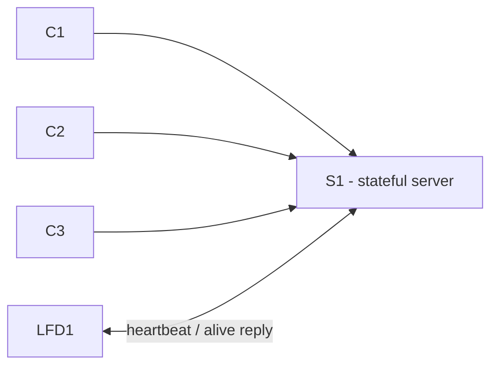

# 18-749 Reliable Distributed Systems - Python

## Introduction

This project implements a simplified fault-tolerant distributed application in **Python**. The full course project gradually adds replication, fault detection, membership management, checkpointing, and recovery so that the application can continue running when a server replica fails.

For Milestone 1, we build only one stateful server, three independent clients, and one Local Fault Detector (LFD). The simplest valid application is a shared counter:

```text
my_state = 0
C1 sends ADD 1
S1 updates my_state to 1
S1 replies with STATE 1
```

The project is demonstrated through terminal output. No website, database, Docker configuration, or cloud deployment is required for Milestone 1.

## Status

**Milestone 1 is implemented and verified** (single-laptop and two-laptop demos, including killing S1 mid-demo). See [AGENT_CONTEXT.md](AGENT_CONTEXT.md) for implementation details, design decisions, and bugs found/fixed during testing.

## Milestone 1

### Goals

1. Run a client-server application.
2. Demonstrate that LFD1 detects when S1 crashes.
3. Support a configurable heartbeat frequency at LFD1.

### Architecture



| Location | Processes |
| --- | --- |
| Sacred/client machine | C1, C2, C3 |
| Non-sacred/server machine | S1 and LFD1 |

`C1`, `C2`, and `C3` can use the same Python file, but they run as separate processes with different client IDs. LFD1 runs on the same machine as S1.

### Required behavior

- [x] S1 listens for TCP connections.
- [x] C1, C2, and C3 each send requests to S1.
- [x] S1 changes `my_state` when it receives a client request.
- [x] Each client prints sent requests and received replies.
- [x] S1 prints received requests, sent replies, and `my_state` before processing and before replying.
- [x] LFD1 sends a heartbeat to S1 repeatedly.
- [x] LFD1 maintains and prints `heartbeat_count`.
- [x] `heartbeat_freq` is configurable through a command-line argument and is not hard-coded.
- [x] S1 prints heartbeat receipt and its alive reply.
- [x] After S1 is killed with `Ctrl-C`, LFD1 prints a failed-heartbeat/timeout message.
- [x] Restart the system using a different heartbeat frequency and repeat the demonstration.

Clients support both modes: `--mode auto` (default, sends on a timer in a loop) and `--mode manual` (prompts for each request from the keyboard).

### Message and logging conventions

Every console message should start with a local timestamp. Each client request needs a unique request number and client ID; each reply returns those same identifiers.

```text
<C1, S1, 1, request>
<C1, S1, 1, reply>
```

Suggested line-based message protocol:

```text
REQUEST|C1|S1|1|ADD|1
REPLY|C1|S1|1|STATE|1
HEARTBEAT|LFD1|S1|1
ALIVE|S1|LFD1|1
```

The exact message format is a team choice; the course guide does not mandate this syntax.

## Python setup

Python's standard library is sufficient for Milestone 1. No third-party packages are required.

```text
socket      - TCP connections
argparse    - command-line arguments
time        - heartbeat scheduling
datetime    - timestamped logs
```

Actual project structure:

```text
project/
  src/
    server_replica.py
    client.py
    local_fault_detector.py
    protocol.py
    net_utils.py
    log_utils.py
  run_demo.sh
  README.md
  AGENT_CONTEXT.md
```

| File | Responsibility |
| --- | --- |
| `server_replica.py` | Runs S1, owns `my_state`, handles requests, replies, and heartbeat responses. |
| `client.py` | Runs as C1, C2, or C3 depending on command-line arguments. Supports `--mode auto`/`manual`. |
| `local_fault_detector.py` | Runs LFD1, sends periodic heartbeats, and reports timeout failures. |
| `protocol.py` | Creates and parses request, reply, heartbeat, and alive messages. |
| `net_utils.py` | Reusable TCP server/client socket helpers, shared by every process. |
| `log_utils.py` | Provides consistent timestamped, color-coded terminal logging. |
| `run_demo.sh` | Launches S1, LFD1, C1, C2, C3 in one tmux window (single-laptop demo). |

### Development mode: one laptop

Fastest option — run the tmux demo script from the repo root (opens all 5 processes in one window):

```text
./run_demo.sh          # heartbeat_freq defaults to 1 second
./run_demo.sh 0.5      # re-demo with a different heartbeat_freq
```

Or run manually in five terminals:

```text
Terminal 1: python3 src/server_replica.py --replica-id S1 --host 0.0.0.0 --port 5000
Terminal 2: python3 src/local_fault_detector.py --lfd-id LFD1 --replica-id S1 --server-host localhost --server-port 5000 --heartbeat-freq 1
Terminal 3: python3 src/client.py --client-id C1 --server-host localhost --server-port 5000
Terminal 4: python3 src/client.py --client-id C2 --server-host localhost --server-port 5000
Terminal 5: python3 src/client.py --client-id C3 --server-host localhost --server-port 5000
```

`--heartbeat-freq` is in seconds and required (no hard-coded default). For local testing, all processes connect to `localhost:5000`.

### Demo mode: two machines

`localhost` means the current machine only.

```text
Server machine:
  S1 listens on 0.0.0.0:5000
  LFD1 connects to localhost:5000

Client machine:
  C1, C2, C3 connect to <server-machine-IP>:5000
```

GitHub shares the source code between teammates. It does not connect the processes; clients connect through S1's hostname/IP address and TCP port.

## Key assumptions and constraints

- The server is deterministic: the same state plus the same request produces the same next state and reply.
- Keep S1 single-threaded for this project stage unless the team has a deliberate deterministic design.
- A heartbeat timeout is a practical failure suspicion: no reply can mean S1 is slow or crashed. In the Milestone 1 demo, S1 is intentionally killed to show the timeout.
- The project focuses on a single server crash and client-server message loss. Milestone 1 directly demonstrates the crash case.
- The final project has S1, S2, and S3, but Milestone 1 uses only S1.
- RM, GFD, replication, checkpoints, duplicate detection, and recovery are not required for Milestone 1.
- Console output is the required demo interface.


